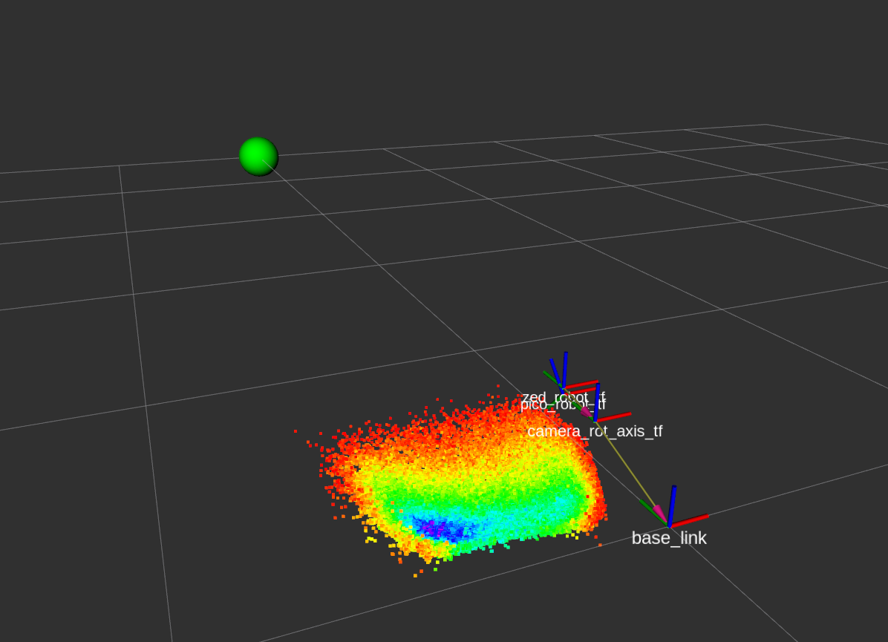
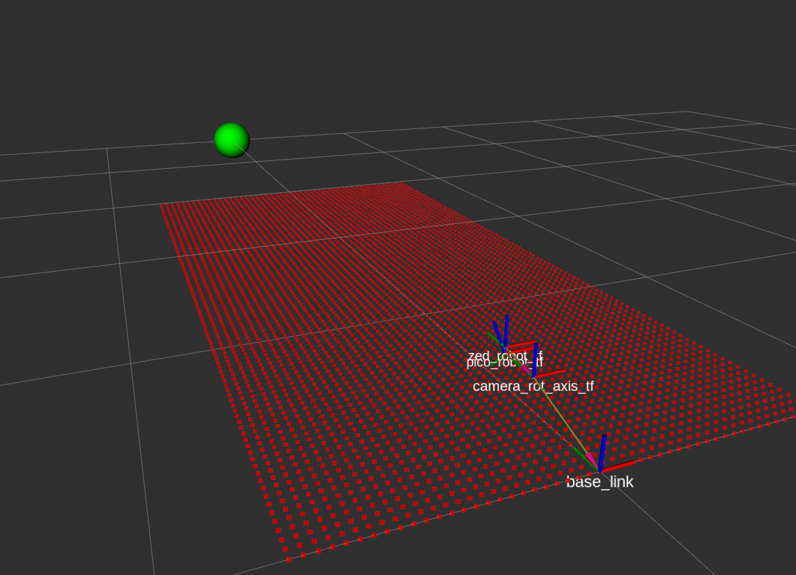
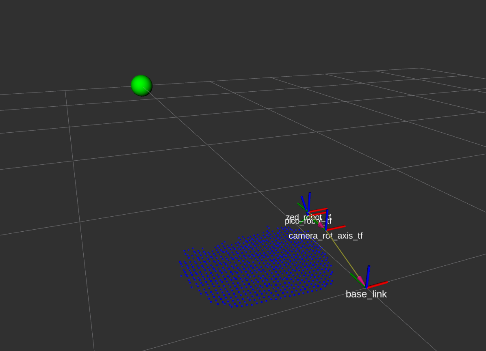

# kd_tree
# kd_tree_node
デプスセンサから取得したポイントクラウドを用いて
接地点計画用の新たなグリッドマップを作成するノード

## parameter(#define)
node_count: 格子点周囲を探索する際のPointCloudの探索数　default 8

voxel_size: 格子点からみた探索する範囲の半径　deault 0.03[m]

## subscribe
1.　set_pc_for_planningで作成されたxy平面上の格子点

2.　デプスセンサから取得したPointCloud（ただし様々なフィルター（メディアン・ローパスなど）処理をしたあとのものが望ましい）

## publish
新たに作成された計画用のポイントクラウド（"/kd_tree_node/kd_tree_filtered_pc"）

格子点のうち，xy平面で見て，その点中心の半径voxel_sizeの円内にデプスセンサからのポイントクラウド（xy座標で比較）がnode_count分探索できた格子点のみがz座標を入力されてpublishされる．

z座標には，探索できたポイントクラウドのz座標の平均が入力される．

探索できなかった格子点についてはz座標にNANが入力されpublishされる．

## 注意事項
2つのsubscribeトピックは，座標系が同じである必要がある．
そのためデプスセンサのポイントクラウドデータの座標変換が必要

## rviz
ROS座標系じゃないです　わかりにくくてすみません

